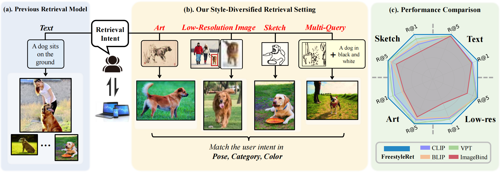
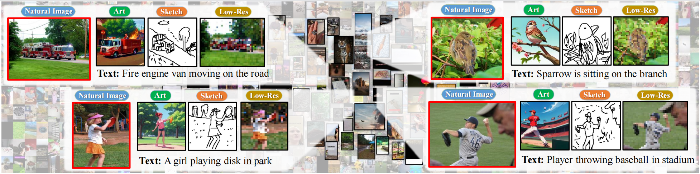
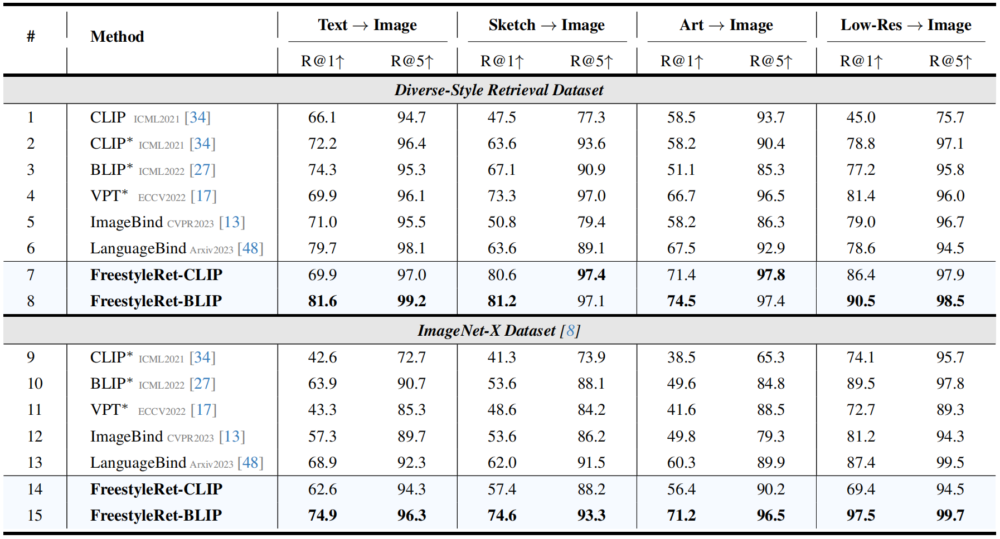

<p align="center">
    
<p>
<h2 align="center"> <a href="">FreestyleRet: Retrieving Images from Style-Diversified Queries</a></h2>
<h5 align="center"> If you like our project, please give us a star ⭐ on GitHub for latest update.  </h2>


<h5 align="center">

[]()
[](https://github.com/YanhaoJia/FreeStyleRet/blob/main/LICENSE)
[](https://github.com/YanhaoJia/FreeStyleRet/blob/main/DATASET_LICENSE)
[](https://hits.seeyoufarm.com) <br>

</h5>


## 📰 News
* **[2023.11.29]**  Code is available now! Welcome to **watch** 👀 this repository for the latest updates.

## 😮 Highlights

### 💡 High performance, plug-and-play, and lightweight
FreestyleRet is **the first multi-style retrieval model** and focus on the precision search field. You can transfer our gram-based style block to **any other pre-trained model** with only **28M** trainable parameter.

### ⚡️ A multi-style, fully aligned and gained dataset
We propose the precision search task and its fisrt corresponding dataset.
Following figure shows our proposed Diverse-Style Retrieval Dataset(**DSR**), which includes five styles: origin, sketch, art, mosaic, and text.

<p align="center">

</p>


## 🚀 Main Results

FreestyleRet achieves **state-of-the-art (SOTA) performance on the DSR dataset and the ImageNet-X dataset**, * donates the results of prompt tuning.
<p align="left">

</p>

## 🤗 Visualization
Each sample has three images to compare the retrieval performance between our FreestyleRet and the BLIP baseline on the DSR dataset.
The left images are the queries randomly selected from different styles. The middle and the right images are the retrieval results of our FreestyleRet-BLIP model and the original BLIP model, respectively.
<p align="left">

</p>


## 🛠️ Requirements and Installation
* Python >= 3.9
* Pytorch >= 1.9.0
* CUDA Version >= 11.3
* Install required packages:
```bash
git clone https://github.com/YanhaoJia/FreeStyleRet
cd FreeStyleRet
pip install -r requirements.txt
```


## 💥 DSR dataset
The datasets is coming soon.

## 🗝️ Training & Validating
The training & validating instruction is in [train.py](train.py) and [test.py](test.py).

## 👍 Acknowledgement
* [OpenCLIP](https://github.com/mlfoundations/open_clip) An open source pretraining framework.
* [LanguageBind](https://github.com/PKU-YuanGroup/LanguageBind) Bind five modalities through Language.
* [ImageBind](https://github.com/facebookresearch/ImageBind) Bind five modalities through Image.
* [FSCOCO](https://github.com/pinakinathc/fscoco) An open source Sketch-Text retrieval dataset.

## 🔒 License
* The majority of this project is released under the MIT license as found in the [LICENSE](https://github.com/YanhaoJia/FreeStyleRet/blob/main/LICENSE) file.
* The dataset of this project is released under the CC-BY-NC 4.0 license as found in the [DATASET_LICENSE](https://github.com/YanhaoJia/FreeStyleRet/blob/main/DATASET_LICENSE) file. 

## ✏️ Citation
@misc{li2023freestyleret,
      title={FreestyleRet: Retrieving Images from Style-Diversified Queries}, 
      author={Hao Li and Curise Jia and Peng Jin and Zesen Cheng and Kehan Li and Jialu Sui and Chang Liu and Li Yuan},
      year={2023},
      eprint={2312.02428},
      archivePrefix={arXiv},
      primaryClass={cs.CV}
}
